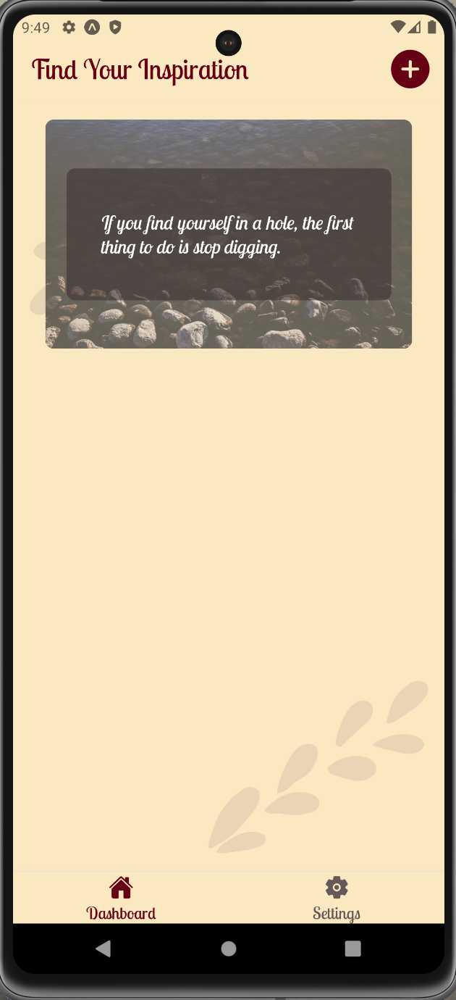
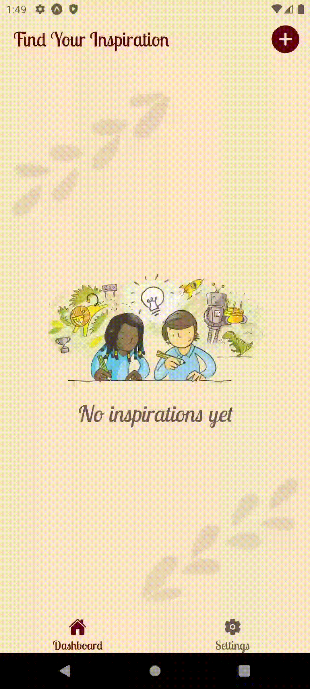

# BSA React Native Base Lecture
Just clone the repository and install all dependencies.

Then you run `npm start` to start the application:

# Application
Your task will be to implement the Inspiration App that can help you to find inspiration or motivation. The app will provide the possibility to generate random inspiration cards or create them from scratch by the users:  

#### App structure description
- ***/assets*** - here you can find all the necessary images and fonts to use within the application (you'll need to apply and use given fonts in the app);
- ***/constants*** - there are color constants for the light and the dark modes;
- ***/contexts*** - there is the ThemeContext, please replace all TODOs with the required logic for theme switching;
- ***/enums*** - here you can find the API and route names enums which you should use while implementing the task;
- ***/helpers*** - there is a helper that generates a random number within the provided range (if you decide to create a new helper - declare it here);
- ***/hooks*** - there is a useTheme hook that uses the ThemeContext you need to complete (if you decide to create a new hook - declare it here);
- ***/navigation*** - there are two navigator files, that you need to add logic into;
- ***/screens*** - here you'll find three screen files you need to fill in (if you want to move some screen components outside - then create a */components* folder inside the corresponding screen folder; if the component you're going to create will be used on several screens - create the */components* folder in the root of the project and place it there);
- ***/services*** - there are two already created services you should use inside *add-inspiration* screen to get random image and quote;
- ***/types*** - there are also some created types (look carefully through them, and also if you need to add a new one - do it here)

## Tasks
### 1. Theme context

- use AsyncStorage to save the theme initializer
- initially, the application should use the light theme
- you feel free to choose the type of the stored item in the AsyncStorage - it can be string or boolean
- `ThemeContext` can return additional values if you need
- The `StatusBar` text color should change depending on the selected theme

### 2. Bottom Tabs Navigator

- navigator should consist of two tabs 'Home' with the ***dashboard*** component and 'Settings' with the ***settings*** component
- each tab should have an icon (you can use `Ionicons` from "@expo/vector-icons"; to follow the example use `home` and `settings` icon names)
- active tab icon and text should have a `PRIMARY` color, and inactive ones - `SECONDARY`
- tabs background should be the same for active tab and not active - `APP_BACKGROUND`
- the font for the screen headers and bottom tabs should be `LobsterTwo-Regular` and have a `PRIMARY` color
- the background of the screen header should be `APP_BACKGROUND`
- all colors should change depending on the selected theme

### 3. Root Navigator

- should consist of the bottom tabs navigator and the `add-inspiration` screen
- the font for the screen headers should be `LobsterTwo-Regular` and have a `PRIMARY` color
- the background of the screen header should be `APP_BACKGROUND`
- all colors should change depending on the selected theme

***Every screen should have the background with two `leaf.png` images placed as shown in the example*** (consider creating a separate `<ScreenBackground />` component and reusing it)

### 4. Dashboard screen

- the `dashboard` screen header should have the `add-circle` button and after pressing it the user should be navigated to the `add-inspiration` screen
- The `dashboard` screen should get the created *Inspiration* as a route params, store it in the state and render as a scrollable list.
- if there are no created inspiration cards, the placeholder with the `empty-placeholder.png` image and **"No inspirations yet"** text should be shown.
- placeholder's text should have `LobsterTwo-Italic` font family

### 5. Inspiration Card

- has a background image with an additional blur layer with 30% of the `APP_BACKGROUND` color
- the card should have a rounded border
- the quoted text is placed at the center of the card, should be shown on a half-transparent background, and have a minimum height of 50% of the card height
- the font color is always `FONT_INVERSE`

### 6. Settings screen 

- should have a `Switch` to toggle the current theme
- on the left of the switch the `sunny` icon is placed, on the right - the `moon` icon
- ***Pay attention***: for the *light* theme the trackColor should be `GREY` and for the *dark* one - `SECONDARY`

### 7. Add Inspiration screen

- screen header should contain the `arrow` back button after pressing on which the user should be navigated back to the ***dashboard***
- the back button should have the `PRIMARY` color
- the `Save` button should be disabled if no image and quote exist.

- #### Elements:
  - inspiration card preview (you can reuse the same component as for the dashboard list): 
    - while there is no image selected `no-image.jpg` should be used as a placeholder
    - while the quote is not added the text block on the card is not shown (meaning the half-transparent wrapper for the quote)
  - two buttons to manage the image adding:
    - the `Choose image` button is used to select the image from the device gallery or camera
      - after pressing the `Alert` is shown with 3 possible options: 'Gallery', 'Camera', and 'Cancel'
      - after choosing the **Gallery** permission should be requested and after it is granted, the user should be led to the gallery, choose the image and after applying it should be set as a card background
      - 
      - after choosing the **Camera** permission should be requested and after it is granted user should be led to the camera, take a photo and after applying it should be set as a card background
      - 
      - after choosing the **Cancel** the Alert is hidden and the image isn't set
    - the `Get random image` button uses the `getRandomImage` service as an onPress handler - after pressing the user should get the random image and it is set as a card background (**hint**: use `download_url` from the response)
    - 
    - to work with gallery and permissions you have the `expo-image-picker` library installed
  - text input to add your own quote - should have placeholder with **Enter your quote here...** text, color for the placeholder - `SECONDARY`, text color for the light theme - `FONT_MAIN`, for the dark - `FONT_INVERSE`
  - 
  - the `Get random quote` button uses the `getRandomQuote` service as an onPress handler - after pressing the user should get the random quote and it is set as a card quote (**Pay attention**: if previously the user has entered a quote in the input it should be cleared after pressing this button)
  - `Save` button - after pressing it the user should be navigated to the dashboard and the inspiration card should appear in the list. When disabled the opacity is set to `0.5`. It should be filled, not outlined as other buttons on the screen.
  - all the buttons, except the `Save` should have the thinnest available border width and border color set to `PRIMARY`

### Additional points
To get additional points you can:
- add keyboard-avoiding logic for the `app-inspiration` screen
